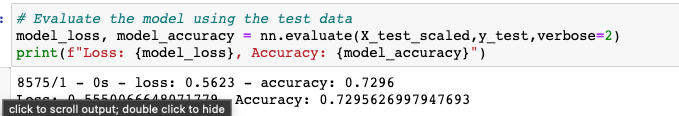

# Neural Network Charity Analysis

## Overview
In this project we were asked to take information from a company who gives loans to charities and develop a Neural Network that might forecast the relative success or failure of companies based upon their profiles.

### Input
To determine a prediction, the `charity_data.csv` file was read in and processed. It contains the following columns:

* EIN - company taxid
* NAME - company name
* APPLICATION_TYPE - Types 0-n
* AFFILIATION - Independent / Company Sponsored
* CLASSIFICATION - C1000, C2000, etc...
* USE_CASE - the product domain (Health Care, Preservation, ProductDevelopment...)
* ORGANIZATION - Type of organization (Association, Co-op, Trust, etc...)
* STATUS - 0/1 - wheter still active
* INCOME_AMT - a range of dollar ammounts showing the org's income range
* SPECIAL_CONSIDERATIONS - Y/N - whether there are special considerations
* ASK_AMT - How much they requested
* IS_SUCCESSFUL - Target, whether they were successful

### Process

1. Data Cleaning: The data was first cleansed of unusable rows and columns that did not impact the study (like EIN and NAME).
2. Data Reduction: Columns which had more than 10 unique values are identified and "binned" using the "plot density" function to get their unique values to 10 or less.
3. Ranges: The "ASK_AMT" column was problematic as it held over 8700 different range values. We were able to reduce the number of unique values to a manageable level by "quantizing" the ranges using the `qcut` and `IntervalIndex` Pandas functions
4. Categorizing: Many of the columns needed to be categorized using the `OneHotEncoder` class.
5. Training / Testing Data: The data were then split into training and testing groups using the `train_test_split` function
6. Scaling: The data were then prepared for the Neural Nets by calling the `StandardScaler` function.
7. Neural Net: The data were passed into a Neural Network with 2 hidden layers. The number of nodes was determined by a `2/3 rule` that was discovered in a Google search. Some experts advocated a "trial and error" approach. One in particular had more concreted suggestions:
   1. https://machinelearningmastery.com/how-to-configure-the-number-of-layers-and-nodes-in-a-neural-network/
   2. https://www.researchgate.net/post/How-to-decide-the-number-of-hidden-layers-and-nodes-in-a-hidden-layer
   3. The "China University of Geosciences" recommended 2/3: "2. The number of hidden neurons should be 2/3 the size of the input layer, plus the size of the output layer."

### Custom Functions

Because we were analyzing so many columns, and doing them in similar ways, we created a handful of "helper" functions. Hopefully these functions will be reused in future projects.

1. `plotit(col)`: plots the density function of the given column
2. `binning(df, col, cutoff)`: A function to apply low-value binned fields to the "Other" bin based on a 'cutoff' value.
3. `annette_binning(df, col, n)`: A function specifically for 'a net' binning (a pun on actress Annette Benning's name). In this case all bins below the 'n' index will be binned with "other."
4. `quantize(df, col, q)`: used to quantize ranges of data using the `qcut` and `InternalIndex` functions.
5. `categorize(df, col, colnames)`: applies the `OneHotEncoder` class to the `col` and accumulates the new column names in the `colnames` array for later use.
6. `n_nodes(prev_n)`: determines the number of hidden layer nodes based on the number of previous layer inputs.

### Output

1. Density Plot: The density plot was applied for columns with high degree of unique values. Three columns in particular: "APPLICATION_TYPE", "CLASSIFICATION", and "ASK_AMT". Then we "eyeballed" the graph to pick a number that was roughly 50% of the values. The "ASK_AMT" column had over 8700 values so that plot was useless. Instead, we applied a "ranging index" (see previous section).

   a. APPLICATION_TYPE: 

   b. CLASSIFICATION: 

   c. ASK_AMT: 

2. Neural Net Summary: Used to describe the parameters of our neural nets.

3. Neural Net Model Loss and Accuracy:

4. AlphabetSoupCharity.h5 - a `h5` version of the model stored on disk

## Results:

The model was designed to answer the following questions:

### 1. What variable(s) are considered the target(s) for your model?

We looked at the "IS_SUCCESSFUL" column for whether the loan was successful.

### 2. What variable(s) are considered to be the features for your model?

For the basic model, all non-identifying columns were used. Specifically;

    a. APPLICATION_TYPE 
    b. AFFILIATION
    c. CLASSIFICATION
    d. USE_CASE
    e. ORGANIZATION
    f. AFFILIATION
    g. SPECIAL_CONSIDERATIONS
    h. ASK_AMT_BIN

Each column was categorized creating a total of 118 features. 

For the optimization portion of the project, alternatives were created by removing one column at a time to give comparisons.

### 3. What variable(s) are neither targets nor features, and should be removed from the input data?

The "EIN" and "NAME" columns were removed from consideration as they were identifiers for individual non-profits. As such they were unique per record and added no value.

### 4. Compiling, Training, and Evaluating the Model

As mentioned above:

    a. Training / Testing Data: The data were then split into training and testing groups using the `train_test_split` function

    b. Scaling: The data were then prepared for the Neural Nets by calling the `StandardScaler` function.

    c. Neural Net: The data were passed into a Neural Network with 2 hidden layers. The number of nodes was determined by a `2/3 rule` that was discovered in a Google search. Some experts advocated a "trial and error" approach. One in particular had more concreted suggestions:

### 5. How many neurons, layers, and activation functions did you select for your neural network model, and why?

    a. Input Layer: The base configuration used an input layer with 118 inputs. The large number of inputs was due to categorizing / binning 9 base categories. Various combinations of the input categories were attempted - removing columns or reducing the size of bins.

    b. Hidden Layers: The model was built first with a single hidden layer and then a second hidden layer to determine if multiple hidden layers would improve accuracy. It turned out that a second layer did not help and only hampered time-performance. The number of nodes for the hidden layers was based on a 2/3 heuristic as mentioned above.

    c. Output Layer: The output layer had a single node with a yes/no output. The accuracy was measured using the `nn.evalute()` function.

    d.  The data were passed into a Neural Network with 2 hidden layers. The number of nodes was determined by a `2/3 rule` that was discovered in a Google search. Some experts advocated a "trial and error" approach. One in particular had more concreted suggestions:
       1. https://machinelearningmastery.com/how-to-configure-the-number-of-layers-and-nodes-in-a-neural-network/
       2. https://www.researchgate.net/post/How-to-decide-the-number-of-hidden-layers-and-nodes-in-a-hidden-layer
       3. The "China University of Geosciences" recommended 2/3: "2. The number of hidden neurons should be 2/3 the size of the input layer, plus the size of the output layer."

    e. The neural net was allowed to run 100 iterations to gain final accuracy. However we observed that the 'net converged on a solution rather quickly - in as few as 10 iterations. More than 10 iterations resulted in no greater accuracy.

    f. Three different Neural Net models were attempted in the Optimization portion of the project:
        i. Dense
        ii. Conv2D
        iii. Flattened/Dense

### 6. Were you able to achieve the target model performance? 

The initial accuracy was about 73% with all 8 input features. We attempted to increase accuracy by eliminating one feature at a time. This did not increase accuracy and in some cases reduced it. We also tried two other models with no advantage. 

### 7. What steps did you take to try and increase model performance?

We attempted running the model with only 7 of the 8 original columns. We removed one column from consideration at a time, for a total of 7. Here is a chart showing the results with 7 columns included and one column removed:

| Column Removed | Accuracy |
|---|---|
|APPLICATION_TYPE removed | 70.89% |
|AFFILIATION removed | 73.26% |
|CLASSIFICATION removed | 72.55% |
|USE_CASE removed | 73.08% |
|ORGANIZATION removed | 72.66% | 
|AFFILIATION removed | 73.22% |
|SPECIAL_CONSIDERATIONS removed | 73.17% |
|ASK_AMT_BIN removed | 72.54% |
|(all included) | 73.10% |

Attempts were made to isolate two specific features that might make the model more accurate. As there are potentially 56 combinations of pairings, only a few were attempted. The choices were based on real world experience.

| Column Paring | Accuracy |
|---|---|
|APPLICATION_TYPE + ASK_AMT | 58.44% |
|APPLICATION_TYPE + AFFILIATION | 71.81% |
|AFFILIATION + ORGANIZATION | 68.26% |
|AFFILIATION + ASK_AMT | 68.76% |
|CLASSIFICATION + ASK_AMT | 58.91% | 

## Summary:

### Results

A Neural Network was developed to predict the success of different organizations that were granted loans. The results with all the features involved showed a 73% accuracy and further alternatives including different models and feature choices did not improve the score.

While using a different model did not result in better performance, other Neural Net models exist that should be tested. The "Dense" model has a good reputation for general solutions, but did not result in the 75% or better accuracy desired. More research is recommended.

### Future Work

The current project requires hand-tuning and manual recording of accuracy. This is a tedious task and would require a human operator many hours or days to attempt all combinations. 

While the current project is fine, it should be possible to create an engine that can attempt all combinations of features and different Neural Network models. While such an engine would take a long time to run, it could be run in a batch mode in off-hours. With the availability of cloud computing, the different models and feature-combinations could be relegated to a suite or farm of virtual machines running in parallel, thus reducing real-time performance without an impact to dollar-cost.

Further, the selection of the number of hidden layers and the number of nodes in the layers appears to be an art rather than a science. Using a brute-force method to choose the layers and nodes would add to the time-complexity of the project. However, as computers are our obedient servants, they can toil for days at a time. The ultimate result would be a fine-tuned model that can be updated on a regular basis as more data is available.

Finally, the model's efficacy should be monitored over time to determine if the real-world results match the expected performance. As more data becomes available, the model can be recomputed and improved.